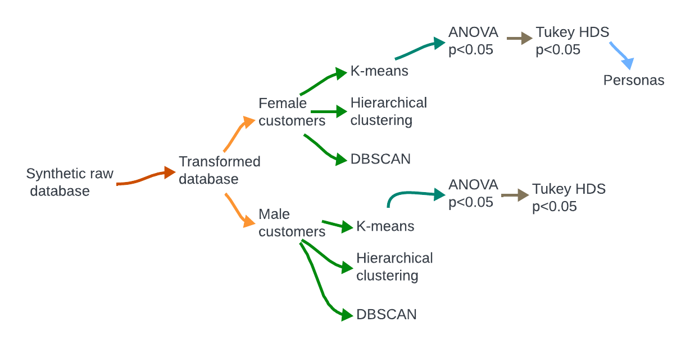

# Brand Co. Client Segmentation

Final project during Ironhack's Data Analytics BootCamp

    

## Index

1. [Intro](#intro)
2. [Segments/Personas](#segmentspersonas)
3. [Methodology](#methodology)
4. [Repository Structure](#repositorystructure)

## Intro 

This project is designed to identify and characterize distinct customer segments based on synthetic data for a hypothetical brand/retailer. To accomplish this objective, we will employ unsupervised learning clustering algorithms like K-means, Hierarchical Clustering, and DBSCAN.

The segmentation and subsequent customer profiling will provide Brand Co. with valuable insights into its customer base. Understanding these segments will enable the company to tailor its marketing strategies and campaigns according to the unique preferences and behaviors of each customer group.

## Segments/Personas 

The project has successfully identified six distinct customer segments, evenly divided into three segments for females and three segments for males. As part of this analysis, unique 'Personas' have been created to represent the female segments.

For detailed profiles of each female 'Persona', access the comprehensive presentation [here](https://view.genial.ly/657050a9d853170013046bf7/interactive-content-ironhackcustomersegmentation).

## Methodology 

We began by assembling a synthetic client database containing dummy variables representing a wide range of demographic details such as residence country, gender, and generation, along with comprehensive product purchase records covering categories, colors, and seasons.

Our approach involved these key steps:

1. Database Exploration and Transformation: We thoroughly examined the database's structure, addressing null values, outliers, and collinearity issues. We prepared the data for analysis by transforming it as necessary.

2. Clustering Model Application: We utilized multiple clustering algorithms (K-means, Hierarchical Clustering, DBSCAN), ultimately selecting K-means due to its ability to generate more distinct client groups.

3. Analysis of Results: We scrutinized the clustering outcomes to extract insightful patterns from the segmented client groups. We assessed cluster differences using statistical tests like ANOVA and Tukey HDS to validate their significance.

4. Creation of Female 'Personas' Profiles: Specifically focusing on the female demographic cluster, we developed detailed profiles highlighting their unique characteristics, behaviors, and preferences.

    

## Repository Structure 

- data: 
  - original: initial synthetic data set 
  - clean: transformed dataset for model
  - clusters: final clusters  

- notebooks: notebooks for data cleaning, models, and statistical analysis 

- images: images used in the project  

- README.md: project description    

